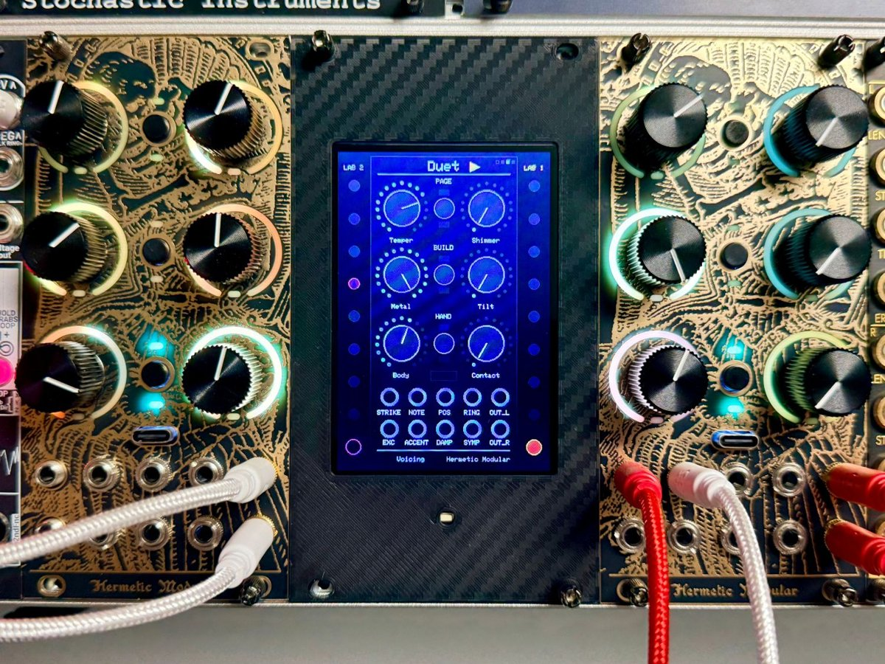
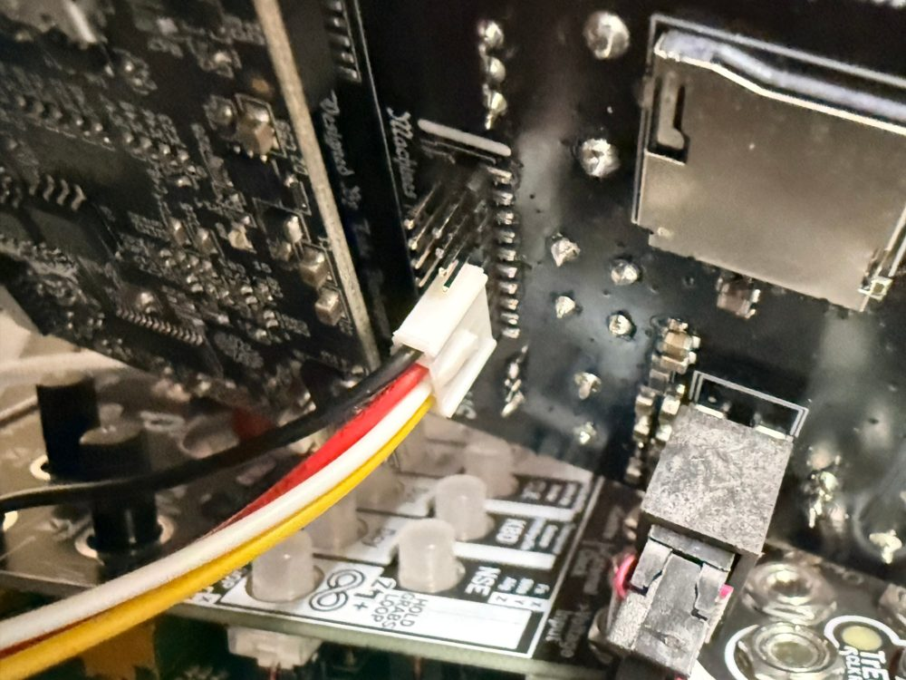
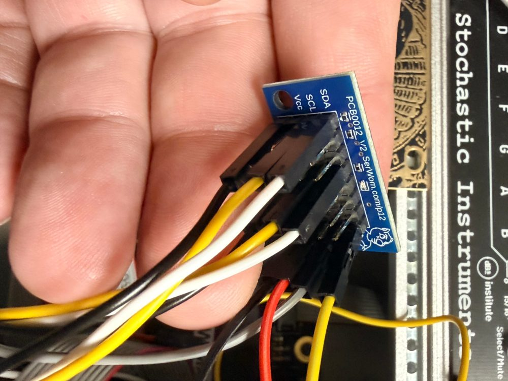

# Duet — two Alchemy Labs that answer each other



*Duet in the rack: Lab #2 on the left, Lab #1 on the right, and between
them the Mega's 3.5" screen in a printed 3U faceplate. The screen is
showing Lab #1's Voicing page, with the triangle beside the title pointing
toward it. Lab #1 has just played its ding (amber, bottom of the right-hand
column), and Lab #2 is answering (magenta, in the left-hand column).*

Firmware for two [Hermetic Modular Alchemy Lab](https://hermeticmodular.com/modules/alchemy-lab)
Eurorack modules and an Arduino Mega 2560 with a 3.5" TFT, working as one
instrument. Each Lab is a physically modelled handpan. Play one, and the
other answers: a canon a few steps up the scale, a mirror image, or a
scatter of notes, after a delay you set. The Mega's screen shows the panel of
whichever Lab you touched last, with a column of lights for each Lab that
flash as notes are played and answered.

```
      you play Lab A                              Lab B answers
   (STRIKE jack or B3)                       (on its own schedule)
            │                                          ▲
            ▼                                          │
   ┌─────────────────┐   EVENT [PLAY f v]   ┌──────────┴──────┐   write [HEAR f v]   ┌─────────────────┐
   │ Alchemy Lab A   │ ───────────────────► │   Mega 2560     │ ───────────────────► │ Alchemy Lab B   │
   │ I2C slave 0x42  │ ◄─── polled reads ── │   I2C master    │ ── polled reads ───► │ I2C slave 0x43  │
   └─────────────────┘                      │   + 3.5" TFT    │ ◄─ EVENT [ANSWER] ── └─────────────────┘
                                            └─────────────────┘
```

## How it works

Both Labs run the same firmware, built with different I2C addresses. They
share one I2C bus with the Mega, and **every Lab is a slave**, so the Labs
cannot talk to each other directly. The Mega relays for them:

1. A strike you play on a Lab (a trigger on STRIKE, or a tap on B3) goes
   into that Lab's outgoing stream as an EVENT `[PLAY, field, velocity]`.
2. The Mega picks it up on its next poll (every 10 ms, and between drawing
   steps) and writes `[HEAR, field, velocity]` straight to the other Lab.
3. The other Lab's **Duet page** decides whether and how to answer, and
   schedules the answer against **its own clock**. Timing is never left to
   the Mega, whose loop pauses while the screen redraws.
4. The answering Lab reports each answer as an EVENT `[ANSWER, …]`, so the
   screen can show it. Answers are **never relayed**, so two Labs both set
   to answer trade phrases instead of feeding back forever.

What travels is a **tone field** (which of the pan's nine notes), not a
pitch. A Lab tuned to a different scale or root plays the same *shape* in
its own tuning, so two pans in different scales translate each other.

## Hardware

- 2 × Hermetic Modular Alchemy Lab, **board v2** (Daisy Seed2 DFM)
- Arduino Mega 2560 (tested with an Elegoo Mega)
- 3.5" 480×320 TFT shield for the Mega: 16-bit parallel, ILI9488 controller
  (the common "3.5 inch TFT for Arduino Mega2560" board)
- A bidirectional I2C level shifter: the common 4-channel BSS138 board
- A way to join the bus lines: the pictured bench uses a Serial Wombat PCB0012
  I2C breakout
- Two pull-up resistors, 2.2 kΩ to 4.7 kΩ (see [Pull-ups](#pull-ups))

### Wiring

**Hermetic Modular's hardware documentation is the authority on this
header.** Read these sections before you wire anything:

- [Expansion header](https://hermeticmodular.com/docs/hardware#expansion-header): the pinout and the headline warnings
- [Pins and alternate functions](https://hermeticmodular.com/docs/hardware#pins-and-alternate-functions): what each pin can do
- [Power and return paths](https://hermeticmodular.com/docs/hardware#power-and-return-paths): the rails you must never join
- [Connecting two Alchemy Labs](https://hermeticmodular.com/docs/hardware#connecting-two-alchemy-labs): UART, SPI or I2C, and which pins never to join
- [I2C between two Labs](https://hermeticmodular.com/docs/hardware#i2c-between-two-labs) and [Two external pull-ups are required](https://hermeticmodular.com/docs/hardware#two-external-pull-ups-are-required): the recipe Duet follows
- [Electrical limits and bring-up](https://hermeticmodular.com/docs/hardware#electrical-limits-and-bring-up): 3.3 V logic, level shifting, cables

What follows is how Duet applies them.

Their [I2C guide](https://hermeticmodular.com/docs/hardware#i2c-between-two-labs) links two Labs directly, with one
Lab as the controller and the other as a target at 0x42. Duet uses the same pins, the same bus (I2C4),
the same speed (100 kHz) and the same pull-up rules. The one difference is
that **the Mega takes the controller's place**, and **both Labs are targets**
(0x42 and 0x43). The Mega has to be the controller anyway to draw each Lab's
panel, and being in the middle is what lets it relay strikes between them.

```
Mega 2560 (5 V) ── level shifter ── bus breakout (3.3 V, pull-ups) ─┬── Lab #1 (0x42)
                                                                    └── Lab #2 (0x43)
```

| Signal | Mega (to the shifter's 5 V side) | Each Alchemy Lab expansion header (3.3 V side) |
| --- | --- | --- |
| SCL | pin 21, or the SCL pin by AREF | **B3** — header pin 8 (PB6, I2C4 SCL) |
| SDA | pin 20, or the SDA pin by AREF | **B5** — header pin 7 (PB7, I2C4 SDA) |
| GND | GND | header pin 5 (any ground pin works: 2, 5, 12–14, 16–19) |

Seen from the back of the module, **pin 1 is at the marked end of the upper
row**, and the upper row runs 1 to 10. It is not the usual odd/even ribbon
numbering: see the [pinout diagram](https://hermeticmodular.com/docs/hardware#expansion-header) and
[pin table](https://hermeticmodular.com/docs/hardware#pins-and-alternate-functions). All three bus pins are on
that row:

```
upper row    1     2    3    4    5    6    7    8    9   10
           -12V   GND   B2   B4  GND   B6   B5   B3   B1   B7
                                           SDA  SCL       (Lab's own
                                                           I2C1, busy)
```

- **Pin 1 is −12 V and pin 11 is +12 V**, and pin 15 is the Lab's analog
  3.3 V rail. Check the harness sits on pins 5, 7 and 8 before powering up,
  and never join any of those rails between two Labs
  ([Power and return paths](https://hermeticmodular.com/docs/hardware#power-and-return-paths)).
- **Never use a full straight-through ribbon cable.** Wire only SDA, SCL and
  ground ([Connecting two Alchemy Labs](https://hermeticmodular.com/docs/hardware#connecting-two-alchemy-labs)).
- **Leave B7 and B8 (pins 10 and 20) alone.** They are the Lab's own I2C1
  bus, which carries its GPIO expander and CV DAC. Duet uses the free I2C4
  on B3/B5 ([Sharing the onboard I2C bus](https://hermeticmodular.com/docs/hardware#sharing-the-onboard-i2c-bus)).

#### Level shifter

The header carries **3.3 V MCU signals**. Hermetic Modular's
[Electrical limits and bring-up](https://hermeticmodular.com/docs/hardware#electrical-limits-and-bring-up) says to
keep header logic within ground and 3.3 V, notes that the header is not
specified as a 5 V interface, and calls for level shifting to other logic
families. The Mega 2560 is a 5 V board: its own I2C pull-ups go
to 5 V, and it needs about 3.5 V to read a high. So a **bidirectional I2C
level shifter** goes between the Mega and everything else. Two channels of a
4-channel BSS138 board are enough.

| Shifter pin | Connects to |
| --- | --- |
| HV | Mega 5 V |
| LV | Mega 3.3 V (the same supply as the pull-ups) |
| GND | Mega GND and the bus ground |
| HV1 / HV2 | Mega SDA / Mega SCL |
| LV1 / LV2 | bus SDA / bus SCL (the breakout) |

The shifter needs both sides powered to pass anything: with LV unconnected
the bus goes dead. BSS138 boards are good to 400 kHz, far above the 100 kHz
Duet uses, and nothing in the code changes.

This is how the bench is wired and running: the Mega alone on the 5 V side,
and the breakout, its pull-ups and both Labs on the 3.3 V side. Without the
shifter, the Mega's own 5 V pull-ups would lift the whole bus above 3.3 V.
That can work, but it is outside the manufacturer's guidance, so don't
leave the shifter out.

#### Pull-ups

Hermetic Modular's rules are in
[Two external pull-ups are required](https://hermeticmodular.com/docs/hardware#two-external-pull-ups-are-required).

- **One set only, on the 3.3 V side:** one resistor from SDA to 3.3 V and one
  from SCL to 3.3 V, for the whole bus. The Labs add none: libDaisy
  configures these pins without internal pull-ups.
- **One 3.3 V source.** Hermetic Modular takes it from one Lab's 3V3A (pin 15)
  and never joins pin 15 between Labs
  ([Power and return paths](https://hermeticmodular.com/docs/hardware#power-and-return-paths)). Here it is the Mega's 3.3 V pin, which
  also feeds the shifter's LV side, so no Lab's rail is involved at all.
- **Value.** Hermetic Modular suggests starting at 4.7 kΩ. The pictured bench
  uses **2.2 kΩ**, soldered onto the breakout's pull-up pads. BSS138 boards
  also carry their own 10 kΩ pull-ups on each side, which combine with
  yours: 2.2 kΩ becomes about 1.8 kΩ, and 4.7 kΩ about 3.2 kΩ.
- **Rise time.** The target is at most 1,000 ns at 100 kHz, with
  tᵣ ≈ 0.8473 × R × C, where C includes both boards and the cable. Their
  own example is about 800 ns for 4.7 kΩ at 200 pF. With the shifter's
  resistors in parallel, 200 pF gives about 300 ns at 1.8 kΩ and 540 ns at
  3.2 kΩ, both comfortably inside.

#### Handling

- **Plug and unplug the harness only with everything powered off**, the
  Mega included. Hermetic Modular says to power down before making or
  changing any cable ([Expansion header](https://hermeticmodular.com/docs/hardware#expansion-header)).
- **Power the Labs and the Mega together.** Don't leave the bus pulled high
  into a Lab that is switched off
  ([Two external pull-ups are required](https://hermeticmodular.com/docs/hardware#two-external-pull-ups-are-required)).
- **Keep the bus wires short**, and run the ground wire alongside SDA and
  SCL rather than taking it some other way
  ([Electrical limits and bring-up](https://hermeticmodular.com/docs/hardware#electrical-limits-and-bring-up)).

The wire colours on the pictured bench, if you want to copy them:

| Signal | Lab harness (4-pin cable) | Mega wires (to the shifter) |
| --- | --- | --- |
| GND | black | black |
| SDA | white | **yellow** (to HV1) |
| SCL | **yellow** | gray (to HV2) |
| 3.3 V (the shifter's LV and the breakout's Vcc) | — | red |

Yellow is SCL on the Lab harness but SDA on the Mega side, so match the two
by signal at the breakout and the shifter, never by colour.



*The back of an Alchemy Lab in the rack, with its four-wire harness plugged
onto the expansion header: black GND, white SDA, yellow SCL.*



*The bus breakout: a PCB0012 V2 from [Serial Wombat](https://www.serialwombat.com/). The
Mega and both Labs each plug into their own column, and every column's SDA,
SCL, Vcc and ground are joined across the board, so this is where the bus
becomes one bus. Its two 2.2 kΩ pull-up resistors are soldered onto the pads
on its back, one from SDA and one from SCL to its Vcc row, and Vcc is wired
to the Mega's 3.3 V pin. This photo was taken before the level shifter went
in, so the Mega's wires here run straight to the breakout. On the finished
bench, that column is fed by the shifter's LV side instead.*

- **Keep the breakout's Vcc wire connected.** With it loose, the two
  pull-ups float and join SDA to SCL, and every transfer times out, while
  the idle lines still look fine. It is the first thing to check if the
  screen stops updating.
- **Label the wires by the Lab's B3/B5**, not by a breakout's silkscreen.
  Swapped SDA/SCL fails silently: every address NACKs and nothing else looks
  wrong.
- The firmware uses **I2C4**, not the Lab's own internal I2C1 bus (PB8/PB9,
  which carries its IO expander and DAC). See
  [I2C between two Labs](https://hermeticmodular.com/docs/hardware#i2c-between-two-labs).

## The instrument

Each Lab is a physically modelled handpan: nine tone fields, each a bank of
resonators tuned the way a pan maker hammers them (modes at f, 2f and 3f),
all ringing together through a modelled shell and air cavity. The module's
built-in manual (visible in the Hermetic Modular web editor) documents every
control.

### Buttons

The Lab has six knobs in three rows of two, with a button between each pair.

| Button | Does |
| --- | --- |
| **B1** (top) | Press and release: next page. Play → Voicing → Duet → back to Play |
| **B2** (middle) | Hold: Build page, only while held. You can turn knobs while holding it |
| **B3** (bottom) | Tap: strike the pan. Hold: palm-mute the ringing |

### Knobs

| Knob | Play | Voicing | **Duet** | Build (hold B2) |
| --- | --- | --- | --- | --- |
| Top left | Scale | Temper | **Answer** | Gu Tune |
| Top right | Root | Shimmer | **Delay** | Fine |
| Middle left | Position | Metal | **Interval** | Spread |
| Middle right | Mallet | Tilt | **Repeats** | Dynamics |
| Bottom left | Decay | Body | **Chance** | Exciter In |
| Bottom right | Sympathy | Contact | **Answer Vel** | Level |

The knob LED rings take each page's colour: **Play** amber, **Voicing** blue,
**Duet** pink, **Build** green.

After a page change, a knob does nothing until you turn it past the value that
page last stored; then it picks up. If a knob seems dead, sweep it past its
old position.

### The Duet page

The Duet page sets how **this** Lab answers strikes played on the **other**
one.

| Knob | Range | What it does |
| --- | --- | --- |
| **Answer** | Off / Canon / Mirror / Scatter, a quarter of the travel each | **Canon** repeats the note moved by Interval. **Mirror** answers low with high (the ding with the top note). **Scatter** answers with any note at random |
| **Delay** | 60 ms – 2 s | Gap before the first answer, and between repeats |
| **Interval** | −4 … +4 tone fields, centre = 0 | How far Canon moves the answer (for Mirror, how far each repeat moves). Past the top or bottom of the pan it bounces back |
| **Repeats** | 1 – 4 | Answers per strike heard. With Canon each repeat climbs another interval, so one strike becomes a short arpeggio. Each repeat is softer |
| **Chance** | 0 – 100 % | How often it answers at all. **Fully anticlockwise never answers** |
| **Answer Vel** | 10 – 100 % | Answer loudness as a share of the strike it heard |

### Jacks

Two rows of five:

| | 1 | 2 | 3 | 4 | 5 |
| --- | --- | --- | --- | --- | --- |
| **Upper** | STRIKE (trigger; its height is the velocity) | NOTE (1 V/oct, quantised to the nine fields) | POS | RING (output: ringing-energy envelope) | OUT L |
| **Lower** | EXC (any audio, played through the pan) | ACCENT | DAMP | SYMP | OUT R |

## Try it

1. Patch OUT L/R of both Labs to your mixer. Hold B2 and turn Level
   (bottom right) up on each.
2. On the answering Lab, press B1 until its LED rings turn pink (the Duet
   page). Set **Answer** to Canon (second quarter of its travel), **Delay**
   to noon, **Interval** to about 2 o'clock (+2), **Repeats** to 2, and
   **Chance fully clockwise**.
3. Tap **B3** on the other Lab. It plays its centre note (the ding); a moment
   later the answering Lab plays two notes up the scale, then two more.
4. Try **Mirror**, **Scatter**, four repeats with a short delay, and the two
   Labs on different **Scales** (Play page, top left).
5. For phrases, patch a sequencer into **NOTE** and its trigger into
   **STRIKE**. The pan's nine notes span only about 1.6 V, so attenuate the
   pitch CV (a 0–5 V source wants roughly a third of its range); anything
   beyond folds back into the pan by octaves.

Either Lab can lead: the other one's Duet page decides the reply.

## The screen

The Mega shows the full front panel of whichever Lab you touched last, with
knob positions, page colour and every legend. It switches when you turn a
knob or press a button on the other Lab, once the one on screen has been left
alone for 1.5 s. Both Labs run the same firmware, so a switch only repaints
what differs.

- **Side columns**: nine lights per Lab, one per tone field, the ding at the
  bottom and the notes climbing upward. **Amber** = played on that Lab,
  **magenta** = that Lab answering. Lab 0x42 is on the right and 0x43 on the
  left; swap them in `strikeX()` in `mega/duet/duet.ino` to match your rack.
- **Triangle beside the title**: points toward the Lab on screen, and that
  Lab's side label lights.

## Building and flashing the firmware

### Toolchain

- `git`, `make`, `dfu-util`
- [Arm GNU Toolchain](https://developer.arm.com/downloads/-/arm-gnu-toolchain-downloads)
  (`arm-none-eabi-gcc`)

### Build

```sh
git clone --recursive https://github.com/etotman/alchemy-lab-duet.git
cd alchemy-lab-duet
make libdaisy                      # once: builds lib/libDaisy

make PANEL_I2C_ADDR=0x42           # first Lab
cp build/duet.bin duet_0x42.bin
make PANEL_I2C_ADDR=0x43           # second Lab
cp build/duet.bin duet_0x43.bin
```

`--recursive` matters: libDaisy has submodules of its own, and without them
the build fails with `stm32h7xx.h: No such file or directory`. On an existing
clone, run `git submodule update --init --recursive`.

The build tree is wiped automatically whenever the address changes, so the
two builds can never share stale objects.

### Flash

Each Lab needs the binary built for its address.

**Web programmer.** The easiest way: load the `.bin` at
[hermeticmodular.com/program](https://hermeticmodular.com/program).

**Over USB with dfu-util.** The Lab must be powered in the rack, with its
front USB-C connected to the computer. The running firmware can reboot
itself into the Daisy bootloader, which appears only briefly, so start
dfu-util waiting **first**. The bootloader and its update mode are described
in [Bootloader and update mode](https://hermeticmodular.com/docs/hardware#bootloader-and-update-mode).

```sh
dfu-util -w -a 0 -s 0x90040000:leave -D duet_0x42.bin -d ,0483:df11 &
sleep 0.5
python3 tools/hostlink_reboot.py reboot /dev/cu.usbmodemXXXXXXXX   # that Lab's port
wait
python3 tools/hostlink_reboot.py hello  /dev/cu.usbmodemXXXXXXXX   # expect: duet | Duet | 0.1.0
```

- Flash one Lab at a time: dfu-util takes whichever bootloader appears.
- Close any web-programmer tab first; the browser holds the serial port.
- "Invalid DFU suffix signature" is a harmless warning.

### Checking the build without hardware

`tools/descriptor_probe/run.sh` renders the control descriptor the module
will report to the web editor, natively, and fails if the module would report
no controls. That failure is the one that makes the web programmer hang at
"reconnect and verify firmware" after a successful flash: every HostLink
firmware must `presets.Manage()` at least one component (here, the Pager).

## Building the Mega sketch

Install with the Arduino Library Manager:

- **MCUFRIEND_kbv** by David Prentice
- **Adafruit GFX Library** by Adafruit

The 16-bit Mega shield needs **two edits in the installed MCUFRIEND_kbv
library**:

| File | Line | Change |
| --- | --- | --- |
| `MCUFRIEND_kbv/utility/mcufriend_shield.h` | 1 | uncomment `#define USE_SPECIAL` |
| `MCUFRIEND_kbv/utility/mcufriend_special.h` | 6 | uncomment `#define USE_MEGA_16BIT_SHIELD` |

On this shield the RD line is not routed (pin D43 goes to the flash chip
instead), so the controller cannot report its ID. The sketch forces it with
`tft.begin(0x9488)`. Under any other ID the layout is perfect but every
colour picks up a heavy blue cast, since the ILI9488 only speaks 18-bit
colour over this bus.

```sh
arduino-cli compile --fqbn arduino:avr:mega:cpu=atmega2560 mega/duet
arduino-cli upload  -p <port> --fqbn arduino:avr:mega:cpu=atmega2560 mega/duet
```

The shield uses pins 22–53 only, so SDA/SCL (20/21) are free for the bus.

### Serial test (115200 baud)

With no hands on the modules, send `a3` to make Lab 0x42 hear tone field 3,
or `b7` to make Lab 0x43 hear field 7. The answer shows on the screen if that
Lab's Answer is not Off. Serial also prints one line per relayed strike and a
status line each second: page, knob positions, played / heard / answered
counts.

## Using the relay in your own firmware

`src/common/panel_i2c` works with any Alchemy Lab firmware. It serves the
panel to the Mega, and it carries short app messages both ways:

```cpp
#include "common/panel_i2c.h"

/* up: queue an EVENT frame (type 0x14, up to 8 bytes, in order) */
const uint8_t msg[3] = {kind, a, b};
panel_i2c::SendEvent(msg, sizeof msg);

/* down: a master write whose first byte is 0x20 or higher */
uint8_t buf[panel_i2c::kMaxMsg], len;
while (panel_i2c::ReceiveMessage(buf, len)) { /* ... */ }
```

Both are control-thread calls (the ControlLoop's poll or frame hooks). The
bytes mean whatever your firmware and your Mega sketch agree they mean. The
relay adds a few milliseconds to about 20 ms, so keep anything
timing-critical on the receiving module's own clock, as Duet does.

### Wire format

| Direction | Bytes |
| --- | --- |
| Mega reads 32 | `[n] [n stream bytes] [padding]`; frames are `AA 55 type len payload crc8` and may span reads |
| Mega writes `0x01` | ANNOUNCE: "send me your labels" |
| Mega writes `0x20 f v` | Duet HEAR: the other Lab played field `f` at velocity `v`/255 |
| frame `0x11` | TEXT: slot, label (knobs 0–5, buttons 6–8, page 9, name 10, jacks 11–20) |
| frame `0x12` | STATE: page, button flags, activity, six knob positions |
| frame `0x13` | COMMIT: kind, page, page count, page colour |
| frame `0x14` | EVENT: Duet `[1 = PLAY \| 2 = ANSWER, field, velocity]` |

## Layout

```
├── src/
│   ├── duet/            the firmware: handpan + Duet page + answer scheduler
│   ├── handpan/         the handpan engine (no libDaisy dependency)
│   └── common/          panel_i2c: the I2C4 slave link to the Mega
├── mega/duet/           the Mega 2560 sketch: panel, strike lights, relay
├── docs/                photos: the rack, the wiring
├── tools/
│   ├── hostlink_reboot.py    read a Lab's firmware version / reboot it to DFU
│   └── descriptor_probe/     check the controls the module will report
├── lib/
│   ├── alchemy-sdk/     Hermetic Modular's Alchemy SDK   (submodule)
│   └── libDaisy/        Electrosmith's libDaisy          (submodule)
└── Makefile             from Hermetic Modular's alchemy-template
```

## Credits and license

MIT, see [LICENSE](LICENSE).

Hardware reference: Hermetic Modular's
[Alchemy Lab hardware documentation](https://hermeticmodular.com/docs/hardware).

Built on Hermetic Modular's
[alchemy-template](https://github.com/hermetic-modular/alchemy-template) and
[Alchemy SDK](https://github.com/hermetic-modular/alchemy-sdk), and
Electrosmith's [libDaisy](https://github.com/electro-smith/libDaisy), all MIT
licensed. The screen uses David Prentice's MCUFRIEND_kbv and Adafruit's GFX
library.
